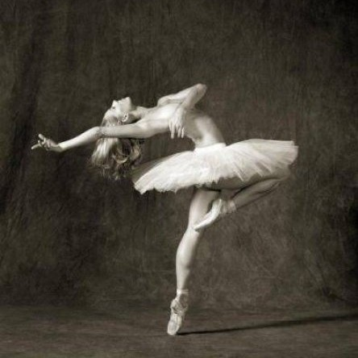
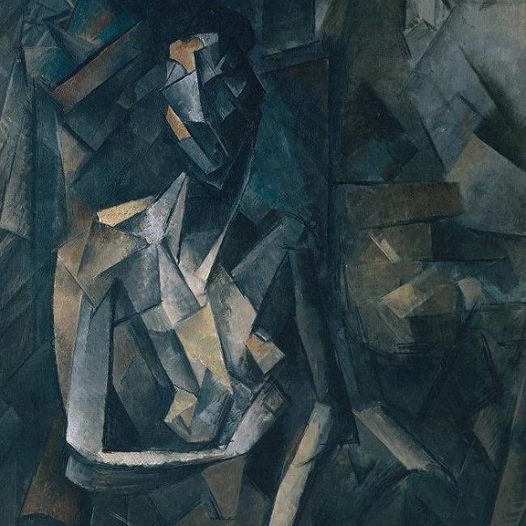
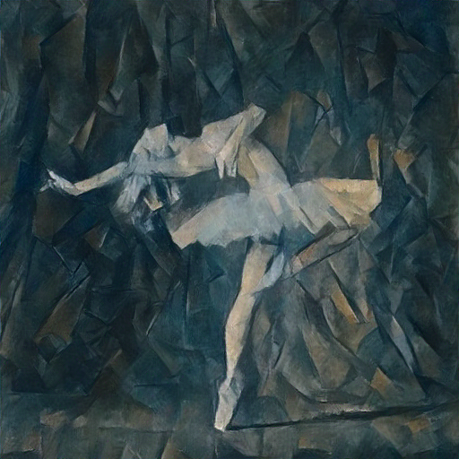
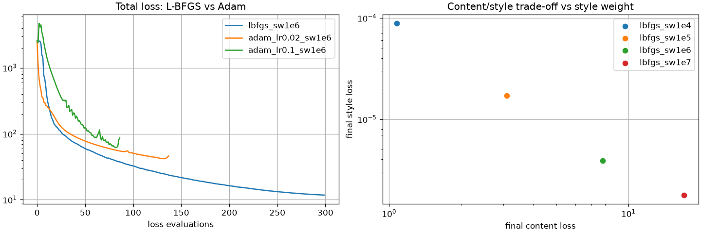

# BrushstrokeNet

BrushstrokeNet is a PyTorch implementation of the seminal paper **"A Neural Algorithm of Artistic Style"** by Leon A. Gatys, Alexander S. Ecker, and Matthias Bethge.

It uses a pretrained **VGG-19** network to separate image content from artistic style and optimizes the pixels of a target image to combine the semantic content of one image with the visual style of another.

## Features

- **VGG-19 Feature Extraction:** Uses pretrained ImageNet weights for high-fidelity feature representations.
- **Content & Style Control:** Customize the balance between content preservation and style intensity.
- **Gram Matrix Optimization:** Captures texture, color correlations, and brushstroke patterns.
- **L-BFGS & Adam:** Supports both optimizers for comparing convergence and optimization behavior.
- **Early Stopping:** Stops optimization when the loss plateaus.
- **Intermediate Outputs:** Saves generated images during optimization to visualize progress.
- **Asynchronous API:** Exposes style-transfer jobs through FastAPI.
- **Docker Support:** Supports both CPU and GPU deployments.

## Results

### Stylized Output

<p align="center">
  
  &nbsp;&nbsp;+&nbsp;&nbsp;
  
  &nbsp;&nbsp;→&nbsp;&nbsp;
  
</p>

### Optimization Curves and Style Weight Sweep
Adam and L-BFGS optimization can be compared using the generated loss curves:



## How It Works

The **output image itself is the only trainable tensor**. The VGG-19 network is frozen and acts as a differentiable feature extractor.

The total loss is:

$$
L =
\alpha L_{content}
+
\beta L_{style}
+
\gamma L_{TV}
$$

where:

- **Content loss** compares VGG feature activations between the target and content image.
- **Style loss** compares Gram matrices of the target and style image across multiple VGG layers.
- **Total variation loss** encourages spatial smoothness and reduces high-frequency artifacts.

The content representation is extracted from `conv4_2`, while style representations are extracted from:

```text
conv1_1
conv2_1
conv3_1
conv4_1
conv5_1
```

The Gram matrix captures correlations between feature maps and therefore represents characteristics such as texture, color, and brushstroke patterns.

### Optimization

Both **L-BFGS** and **Adam** are supported.

L-BFGS is particularly effective for neural style transfer because the optimization problem involves a relatively small number of variables—the pixels of the generated image—and its quasi-Newton updates can converge quickly.

The content and style target features are computed without gradient tracking because they remain fixed throughout optimization. Only the computation graph from the generated image through VGG to the loss needs to be constructed.

## Installation

Clone the repository and install the dependencies:

```bash
git clone https://github.com/yourusername/BrushstrokeNet.git
cd BrushstrokeNet

uv sync
```

## Run

Start the FastAPI development server:

```bash
uv run fastapi dev app/main.py
```

The API will be available at:

```text
http://localhost:8000/docs
```

### Docker

CPU:

```bash
docker compose up --build api
```

GPU:

```bash
docker compose up --build api-gpu
```

GPU execution requires the appropriate container runtime and GPU support on the host.

## API Usage

Submit a style-transfer job:

```bash
curl -F content=@data/content/content_image_1.png \
     -F style=@data/style/style_image_1.png \
     -F style_weight=1e6 \
     -F optimizer=lbfgs \
     localhost:8000/jobs
```

The API returns a job ID:

```text
202 {"job_id": "..."}
```

Check job status and progress:

```bash
curl localhost:8000/jobs/<job_id>
```

Download the generated image:

```bash
curl -o out.png localhost:8000/jobs/<job_id>/result
```

## Experiments

Compare Adam and L-BFGS:

```bash
uv run python -m experiments.compare_optimizers \
  --content data/content/content_image_1.png \
  --style data/style/style_image_1.png
```

The experiment generates:

- Adam vs. L-BFGS loss curves
- Style-weight experiments
- Generated outputs
- `results.csv`

Results are stored in:

```text
outputs/experiments/
```

## Tests

Run the test suite:

```bash
uv run pytest
```

Tests run offline using random VGG weights and small 64×64 images.

## Project Structure

```text
BrushstrokeNet/
├── app/                  # FastAPI application
├── data/
│   ├── content/          # Content images
│   └── style/            # Style images
├── experiments/          # Optimizer and hyperparameter experiments
├── outputs/              # Generated images and experiment results
├── tests/                # Test suite
├── pyproject.toml        # Project configuration and dependencies
├── docker-compose.yml
└── README.md
```

## Reference

Gatys, L. A., Ecker, A. S., & Bethge, M. (2015).  
*A Neural Algorithm of Artistic Style*.  
[arXiv:1508.06576](https://arxiv.org/abs/1508.06576)
